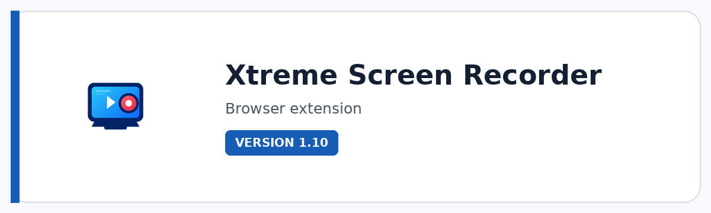

# Xtreme Screen Recorder

**Record, compose, recover, convert, and manage screen captures locally — with camera, audio, regions, overlays, scene elements, and a private library.**

  

  

---

## Overview

Xtreme Screen Recorder is a production-minded browser recorder for demos, training, tutorials, presentations, troubleshooting, walkthroughs, and creator workflows. It combines screen capture with microphone/system-audio mixing, camera overlay, region control, recording presets, local format conversion, scene elements, reliability monitoring, recovery, and a private local library.

The workflow is deliberately local-first: recordings are processed on the machine rather than uploaded as part of the normal product flow. That makes it a strong fit for internal demonstrations, client work, technical documentation, education, and any situation where speed and control matter as much as the final video.

## Key features

- **Screen, camera, microphone, and system-audio workflows** with device selection and independent mix levels.
- **Recording presets up to 4K / 60 FPS** plus 1080p, 720p, presentation, vertical, and lightweight GIF-oriented presets.
- **Multiple output formats** including WebM, MP4, MOV, MKV, AVI, OGV, and GIF through local conversion workflows.
- **Capture-region controls** for full source, centered 16:9, 9:16, 1:1, or custom X/Y/width/height regions.
- **Camera overlay customization** with position, size, shape, mirroring, and custom placement.
- **Scene elements** for blur areas, logos, and styled text overlays that can be positioned and resized in the composition.
- **Reliability monitor and segmented recovery** with FPS, dropped-frame, A/V sync, segment, memory, and local-storage visibility.
- **Private local library** for saved recordings that remain available across browser sessions until removed.

## Standout tools and workflows

| Tool / workflow | Why it matters |
|---|---|
| **Recording Presets** | Move quickly between high-quality, balanced, compact, presentation, vertical and GIF-oriented setups. |
| **Device & Mix** | Switch camera/microphone devices and control microphone/system audio levels from the recording workspace. |
| **Region Capture** | Crop the capture before encoding using fixed aspect presets or a custom region. |
| **Camera Overlay** | Place a mirrored or standard camera feed in a configurable corner or custom position. |
| **Scene Composer** | Add blur regions, logos and styled text directly to the recording composition. |
| **Local Conversion** | Convert captured media locally into multiple delivery formats. |
| **Reliability Monitor** | Watch actual FPS, dropped frames, A/V sync, segments, memory and local storage while recording. |
| **Recovery + Library** | Recover interrupted sessions where possible and keep successful recordings in a private local library. |

## Product status

| Item | Details |
|---|---|
| Status | **Current release** |
| Version | 1.10 |
| Product type | Browser extension |
| Browsers | Chromium / Edge / Firefox |
| Best for | Demos, training, tutorials, technical documentation, internal/client walkthroughs |

## Media

Additional screenshots and workflow previews are coming soon.

## Documentation and support

| Resource | Link |
|---|---|
| Support guide | [SUPPORT.md](SUPPORT.md) |
| Repository changelog | [CHANGELOG.md](CHANGELOG.md) |
| Issues | [Open or review issues](https://github.com/pacosalasv/Xtreme_Screen_Recorder-Support/issues) |
| Discussions | [Ask questions and share feedback](https://github.com/pacosalasv/Xtreme_Screen_Recorder-Support/discussions) |

## Support development

If this tool saves you time, Ko-fi support helps fund maintenance, compatibility work, documentation, testing, and continued development.

  

## Ecosystem

| Destination | Link |
|---|---|
| Xtreme Mindset | [Product lab and experimentation](https://xtrememindset.blogspot.com/) |
| Paco Salas \| DRH | [Software, automation, 3D, AI, and product work](https://pacosalasv.blogspot.com/) |
| KreaOn | [Applied technology education](https://www.kreaon.com/) |
| DRH Blender Tools | [Browse Blender tools on BlendKit](https://www.blendkit.com/?query=author_id:205846) |
| Ko-fi | [Support development](https://ko-fi.com/pacosalasv) |

## License

Licensing and usage terms are provided with the current Xtreme Screen Recorder distribution.
